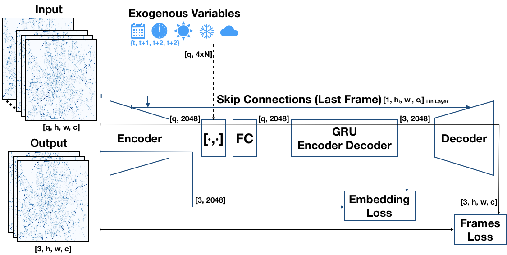

# Recurrent Autoencoder with Skip Connections and Exogenous Variables for Traffic Forecasting

This is the implementation of the paper "Recurrent Autoencoder with Skip Connections and Exogenous Variables for Traffic Forecasting" submitted to the Traffic4cast Challenge 2019 at NeurIPS (https://www.iarai.ac.at/traffic4cast/).

## Documentation
Our documentation is available in [arxiv](https://arxiv.org/abs/1910.13295)!

Very soon a full paper will be available in the [Proceedings of Machine Learning Research. PMLR, 2020](http://proceedings.mlr.press/).

## Summary
Given a sequence of frames of length q in {1,2, ..., 12} in a video, it can predict the next 3 consecutive frames. 

Our model accepts a sequence of any size as input by iteratively using the encoder and concatenating its outputs. Then a recurrent encoder accumulates the temporal information of the input sequence into a single representation, and a recurrent decoder gives us three embedded predictions. Afterward, these predictions are upsampled to the original space by a decoder that uses skip connections from each layer of the encoder, but only from the last frame in the input sequence including the image. The Embedding Loss makes the recurrent layer GRU together with the encoder to produce better predictions in a low
dimensional space. Frames Loss and skip connections from sibling layers in the encoder empowers
the decoder to produce outputs with high definition. Exogenous variables are concatenated with the
encoder output plus a fully connected layer before recurrent layers. 

## Training

* The notebook 'Train.ipynb' can be used to train any model except the one explained bellow, evaluate them, and even generate a submission for the challenge with the proper format.
* The notebook 'train-RAE_Clf' allows training the model called in the paper as 'RAE_Clf'
* The notebook 'exogenous_data.ipynb' shows figures  of aggregated traffic. To use it, change the route in src/exogenous_data.py, variable DAYS_INFO_PATH to point agg_data/1_regions_features_mean.npy
* The folder src contains all the scripts that allow the notebooks to run:
    * src/data.py: Contains the class dataset that allows different sampling strategies. To use it, just change the variable DATA='/home/pherruzo/data/nips_traffic/' to the folder containing the data in your machine.
    * src/models/* : Our best model (image above) can be found in file 'RAEwSCwWSwIN.py', as well as 'RAE_Clf' in 'RAEwSCwWSwINxCLF.py' 
    * models.py: Baseline models and basic autoencoder can be found here
    * exogenous_data.py: Contains all exogenous data retrieval
    * charts: Contains functions to plot aggregated traffic
    * losses.py: Contains loss functions definition and methods to compute the performance of the models

## Cite
Pedro Herruzo and Josep L. Larriba-Pey. Recurrent autoencoder with skip connections and exogenous variables for traffic forecasting. In Hugo Jair Escalante and Raia Hadsel, editors, Post proceedings of the NeurIPS2019 Demonstration and Competition Track, submitted, 2020, Proceedings of Machine Learning Research. PMLR, 2020.

## Contact
If you need help, links to the dataset, or scripts to download the exogenous data, do not hesitate to contact us: pherruzo@ac.upc.edu
